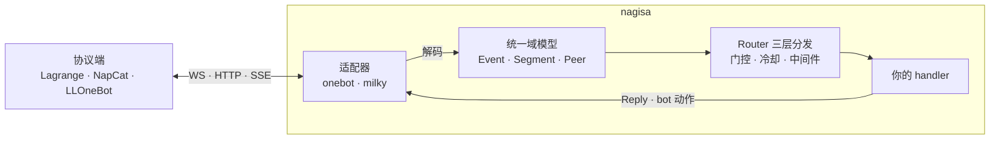
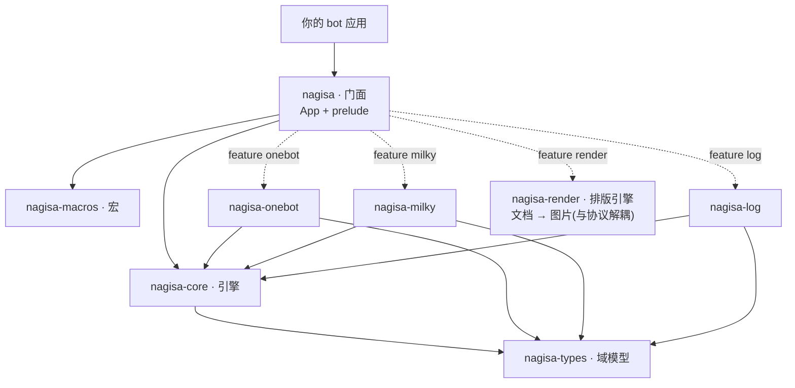

<div align="center">


[](https://crates.io/crates/nagisa)
[](https://docs.rs/nagisa)
[](https://crates.io/crates/nagisa)
[](#license)
[](https://github.com/djkcyl/nagisa/actions)

[快速上手](#快速上手) · [安装](#安装) · [协议与传输](#协议与传输) · [示例](#示例) · [设计要点](#设计要点) · [docs.rs ↗](https://docs.rs/nagisa)

</div>

**nagisa** 是 Rust QQ bot 框架库，把 **OneBot v11** 与 **Milky** 两套协议接到同一套强类型 API 上：业务代码只看见 `Event` / `Message` / `Segment` / `Peer` / `Uin` / `MessageId`，不碰协议 JSON 与 retcode，换协议端不改业务代码。协议端（Lagrange / NapCat / LLOneBot 等真正登录 QQ 的外部程序）需自行部署，nagisa 负责连上它。



## 安装

```toml
[dependencies]
nagisa = "0.5"                                               # 默认含 onebot + milky 两套适配器
# nagisa = { version = "0.5", features = ["log", "render"] } # 可选：事件日志 / 排版引擎（文档 → 图片）
```

或一行 `cargo add nagisa`。另需一个已登录 QQ 的协议端（[Lagrange](https://github.com/LagrangeDev/Lagrange.Core) / NapCat / LLOneBot 等）在外部运行，Nagisa 负责连上它。

## 快速上手

```rust,ignore
use nagisa::prelude::*;

// 「@bot echo 你好」 → 「echo: 你好」
#[command("echo", mention_me)]
async fn echo(reply: Reply, args: ArgText) -> HandlerResult {
    reply.text(format!("echo: {}", args.0)).await?;
    Ok(())
}

#[tokio::main]
async fn main() -> Result<()> {
    App::new()
        .run_onebot(
            OneBotConfig::new("ws://127.0.0.1:8080/onebot/v11/ws"),
            ctrl_c_shutdown(),
        )
        .await
}
```

- 换协议：`run_onebot(OneBotConfig::new(..))` → `run_milky(MilkyConfig::new(..))`，handler 一字不改。
- 前提：一个已登录 QQ 的协议端（见 [安装](#安装)）。
- `use nagisa::prelude::*;` 是业务侧唯一需要的导入，不直接引用 `nagisa-core` / `nagisa-types` 等底层 crate。

## 命令

```rust,ignore
#[command(
    "转账", "transfer",                  // 命令词 = 前导位置参数(匹配器三选一,见下表)
    mention_me,                          // 要求 @bot
    gate = group_admin() | superuser(),  // 门控:任意 Rule 表达式
    cooldown = 30,                       // 冷却(秒);被 gate 拒掉的尝试不消耗
    description = "给别人转账",
    usage = "转账 @某人 <金额>",
)]
async fn transfer(reply: Reply, args: Args<Transfer>) -> HandlerResult {
    let Transfer { target, amount } = args.0;
    // ...
    Ok(())
}
```

`#[command(..)]` 属性键：

| 类 | 键 |
|---|---|
| 匹配器（三选一，必给） | **前导位置参数** `"a", "b"` 字面量命令词（写在最前）；`regex = "^..$"` 原始正则；`slots = Type` 用 `#[derive(Slots)]` 类型作头 |
| 行为 | `mention_me` 要求 @bot；`top` 置顶观察者（恒跑，不被 waiter 拦截）；`priority = N` 越大越先；`usage = ".."` 参数解析失败时回贴的用法串（不配则静默跳过） |
| 门控 | `gate = <Rule 表达式>`；`cooldown = <秒数或 Cooldown 构建体>`（恒在门控链最右：权限先判，通过才盖戳） |
| 元数据 | `id` / `name`（缺省取函数名）、`description`、`can_disable`（默认 true）、`default_enable`（默认 true）、`hidden`（默认 false） |

命令**头**写在属性里，**参数**声明在 handler 形参上（`Args<T>` / `ArgText` 等），就近落在同一个函数。

## 参数

```rust,ignore
#[derive(Args)]
struct Transfer {
    #[arg(at_or_id)] target: Uin,                    // @某人 或 裸 QQ 号
    amount: u64,                                     // 文本位置参数
    #[arg(long, short = 'm')] memo: Option<String>,  // --memo xx / -m xx
    #[arg(flag, short = 'f')] force: bool,           // -f / --force
}
```

`#[arg(..)]` 字段属性：

| 形态 | 写法 |
|---|---|
| 文本位置参数 | 默认（无 `#[arg]`）；`Option<T>` 可选；`#[arg(default = "..")]` 缺省值 |
| 剩余文本 | `#[arg(rest)]`；`#[arg(rest, raw)]` 保真原文空白、旗标只认前导 |
| 选项 / 旗标 | `#[arg(long)]`（可 `long = "name"`、`short = 'c'`）；`#[arg(flag)]` 布尔旗标 |
| 消息元素 | `#[arg(image \| record \| video \| at \| reply \| face)]` 按类型从消息段里取；`Option<T>` 可选；加 `rest` 收全部（`Vec<Media>`） |
| @ 或裸号 | `#[arg(at_or_id)] u: Uin`：取 @ 元素，缺则取下一个文本词当 QQ 号（群 @、私聊输号一字段通吃） |

文本字段类型需实现 `FromArg`（String / 整数 / f64 / bool / `Uin` 内置）；元素字段类型固定：image/record/video → `Media`、at → `Uin`、reply → `MessageId`、face → `String`。受限选项用 `#[derive(ArgEnum)]`（变体名小写匹配，`#[arg(rename = "原曲", alias = "origin")]` 改名/加别名）。

另一套头匹配：`#[derive(Slots)]` 把「命令头 + 命名正则槽」结构体化——`#[slots(full = "签到", usage = "..")]` + 字段上 `#[slot(re = r"(\d+)")]` / `#[slot(union = ["a", "b"])]` / `#[slot(tail)]`，同一类型既当 `#[command(slots = T)]` 的头又当 `Slots<T>` 提取器；`matcher!{}` 是它的内联纯匹配器糖。

## 事件

```rust,ignore
#[event(MemberJoin, description = "新人入群欢迎")]
async fn welcome(reply: Reply, join: MemberJoin) -> HandlerResult {
    reply.msg().at(join.user).text(" 欢迎!").send().await?;
    Ok(())
}
```

`#[event(<Kind>, ..)]` 第一个位置参数是 `EventKind` 变体，其余键同 `#[command]`（`top` / `priority` / `gate` / `cooldown` / 元数据；无匹配器，`usage` 被显式拒绝）。可用 Kind：

- 消息：`Message`
- 群通知：`MemberJoin` `MemberLeave` `Mute` `WholeMute` `AdminChange` `GroupNameChange` `GroupCardChange` `GroupTitleChange` `GroupDismiss` `Honor` `LuckyKing` `EssenceChange` `Recall` `Reaction` `GroupFileUpload`
- 好友/杂项通知：`FriendAdd` `FriendFileUpload` `Nudge` `PokeRecall` `PeerPin` `InputStatus` `ProfileLike` `GrayTip` `OnlineFile` `FlashFile`
- 请求：`FriendRequest` `GroupJoinRequest` `GroupInvitedJoin` `GroupInvite`
- 生命周期：`Connect` `Disconnect` `Ready`（self_id 解析完成，启动逻辑写在这）`Heartbeat` `BotOnline` `BotOffline`
- 兜底：`Raw`

## 插件与开关

```rust,ignore
plugin! {
    name = "复读机",
    key = "echo",
    category = Fun,                 // Core | User | Tool | Fun | Push | Admin 之一
    description = "把你说的话再说一遍",
    usage = "echo <内容>",
    // 可选:version / can_disable / default_enable / hidden / maintain
}
```

同模块（及子模块）里的 `#[command]` / `#[event]` 按 `module_path!()` 最长前缀自动归属本插件，`App::new()` 经 `inventory` 一次性收集，`main` 里零登记代码。不在任何 `plugin!{}` 模块下的裸 `#[command]` 会落进按 `module_path` 合成的隐式插件——没有像样的身份和开关，别这么写。开关分两层：插件总开关 + 每触发器子开关（`echo` / `echo.transfer`），按会话覆盖 > 全局 > 默认；`registered_plugins()` / `registered_triggers()` 可枚举注册表。

> **注册可见性**：`inventory` 靠链接器收集注册项。插件 crate 若没被 binary 源码引用，会被链接器整体丢弃——**命令静默消失，零报错**。务必 `use my_plugins::*;` 或调一次 `force_link()`，详见 `App::new` 文档。

## 门控与冷却

内置 `Rule`，用 `&` `|` `!` 组合（左短路）：

| 类 | 规则 |
|---|---|
| 场景 | `to_me()`（私聊或群里 @bot）、`group_only()`、`private()`、`in_group(g)`、`from_user(u)` |
| 内容 | `keyword(["词", ..])` |
| 权限 | `superuser()`（名单经 `App::superusers([..])` 配置）、`group_admin()`、`group_owner()`——群角色查询结果在本事件内 memo，组合也只发一次请求 |
| 全局闸 | `switch(key)` 运行期开关、`awake()` 休眠时否决并回贴、`awake_silent()` 静默版 |
| 包装 | `replying(rule, on_veto)` 把任意规则变成「否决时回话」 |
| 自定义 | `Rule::pred(\|ctx\| ..)` 同步谓词、`Rule::new(..)` 异步 |

注意 `group_admin()` / `group_owner()` 在私聊场景恒为否（fail-closed），跨场景管理命令写 `gate = group_admin() | superuser()`。

冷却三种用法：`cooldown = 30`（每用户全局桶）；`cooldown = Cooldown::new(30).per_trigger().max_exec(3).bypass(superuser())`（滑动窗口多次额度，`.per_peer()` / `.global()` 改作用域）；数据派生的条件冷却用 `Cd` 提取器命令式控制——`cd.gate(key, dur)?` 检查并盖章、`cd.ready(key, dur)` 只看不盖、`cd.stamp(key, dur)` 成功后才盖。全局限流用 `RateLimit` 中间件（`App::layer`）。

## 提取器

handler 形参按类型注入，类型提不出来时该 handler 自动跳过；`Option<T>` 把任一项变成可选。

| 组 | 类型 |
|---|---|
| 事件 | `Arc<Event>`、`MessageEvent`、`Notice`、`Request`、`Meta`、`Scene` |
| 场景过滤 | `GroupMessage`、`PrivateMessage`、`Sender`（Uin）、`EventPeer`（Peer）、`ToMe`（bool） |
| 命令（需匹配器命中） | `Command`（命中词）、`ArgText`（剩余文本）、`CommandArg`（剩余段）、`Captures`（正则捕获）、`Args<T>`、`Slots<T>` |
| 消息元素 | `At`（首个 @）、`Image`（首个图片；无命令上下文时在整条消息里找） |
| 设施 | `Bot`、`Reply`、`State<T>`（`App::data` 注入的共享态）、`Session`（多轮会话）、`Cd`（冷却句柄） |
| 事件专属 | `MemberJoin` / `Nudge` / `Recall` / `Ready` … 与 `#[event(Kind)]` 同名的结构化载荷 |

自定义提取器：给类型实现 `FromContext`（impl 块标 `#[nagisa::async_trait]`）。

## 多轮会话

```rust,ignore
#[command("猜词")]
async fn start(reply: Reply, ep: EventPeer, session: Session) -> HandlerResult {
    let waiter = session.waiter().scope(Scope::peer(ep.0)).build(); // 整个群的下一条消息
    reply.text("开始猜词,直接发答案(发\"取消\"结束)").await?;
    while let Some(m) = waiter.recv::<GroupMessage>(Duration::from_secs(60)).await {
        // 看 m 决定回应、break 或继续等
    }
    Ok(())
}
```

- `recv::<T>()` 可等任意提取器类型——等图片就 `recv::<Image>()`，和读内联参数 `#[arg(image)]` 得到的是同一个 `Media`，「内联给参或事后追问」一处分支搞定。
- 高层封装：`confirm(d, 谁, "是", "否")`（只收指定用户的回复，认不出的输入自动追问）、`recv_text(d, 取消词)`、`recv_parse(d, 取消词, 解析fn)`——解析失败自动回贴追问。
- 嵌套会话深者优先，guard Drop 自动摘除；命中的 waiter 默认吞掉该事件（`top` 观察者不受影响，恒跑）。
- `session.single_flight_user()`：同一用户的多步流程加 single-flight 闸，防并发竞态。
- 跨会话配对用 `Rendezvous<K, V>`（带 TTL 的「一处发码、另一处认领」，如群里贴 token、私聊认领绑定）。

## 发消息

```rust,ignore
reply.text("收到").await?;                          // 单段快捷:text / image / at / face
reply.reply("收到").await?;                         // 同上,但引用触发消息
reply.msg().at(u).text(" 欢迎!").image_path(p)      // 混排链式:text / at / at_all / face
    .send().await?;                                 //   / image_url / image_bytes / image_path
                                                    //   / reply_to_trigger / push(Segment)
let m = Msg::new().text("公告").image_url(url).build(); // 脱离 Reply 拼 Message
bot.send(peer, m).await?;                           //   交给 bot 发到任意会话
```

`reply.send(&[Segment])` / `reply.quote(..)` 直接收段数组；链式收尾用 `.send()` 或 `.quote()`（带引用）。所有发送都返回 `MessageId`，可存下来供撤回/引用。

## 动作

```rust,ignore
bot.send(peer, msg).await?;               // 通用动作:Bot 上的 inherent 方法
bot.group(g).member(u).mute(600).await?;  // 类型化目标选择器
bot.actions().<vendor 专属方法>(..).await?; // 厂商/协议专属直达(OneBot 侧 145 个、Milky 侧 12 个)
```

当前端不支持的动作返回 `Error::Unsupported`（不会编译失败）：`bot.supports(Capability::..)` 运行时探测、`err.is_unsupported()` 降级。连上后框架读 `get_version_info` 判定 `Vendor`（Lagrange / NapCat / LLOneBot / Other）自动选 per-vendor 动作名别名；Milky 端经 `ImplInfo` 识别。逃生口：入站解不出的内容降级 `Event::Raw` / `Segment::Raw` 不丢数据，出站有 `call_raw` 直发任意动作。

## App

| 组 | 方法 |
|---|---|
| 注册 | `command(matcher, h)` / `on(h)` / `on_top(h)` 显式注册（与宏注册并存）；`command_with` / `on_with` 带门控变体 |
| 状态 | `data(T)`（供 `State<T>` 取）、`superusers([..])` |
| 服务 | `service(svc)` 必选服务（`prepare`/`run` 失败即中止 bot）；`service_optional(svc)` 可选服务（失败只记日志、不拖垮 bot，对应 `Supervisor::add_optional`）；`service_data::<T>(value)` 把共享句柄预置进服务的 `ServiceBus`；`run_with` 还会自动把 `Bot` 发布进 bus（服务 `bus.get::<Bot>()` 取） |
| 行为 | `debug()`（parse-miss 回贴自动提示）、`layer(中间件)` |
| 开关持久化 | `restore_switches(..)` 启动恢复、`on_switch_change(..)` 变更回调 |
| 共享态句柄 | `enabled_handle` / `cooldown_store_handle` / `rendezvous_handle` / `kill_switch_handle` / `sleep_handle` …（在 `run_*` 前拿走,跨任务持有） |
| 运行 | `run_onebot(cfg, shutdown)` / `run_milky(cfg, shutdown)`；`ctrl_c_shutdown()` 给一个 Ctrl-C 取消的 `ShutdownToken` |

## 协议与传输

协议端是真正登录 QQ、需你自行部署的外部程序；nagisa 连上它，并按其上报信息自动识别厂商、抹平各家动作名差异。已适配：

- **OneBot v11**：[Lagrange.OneBot](https://github.com/LagrangeDev/Lagrange.Core) / [NapCat](https://github.com/NapNeko/NapCatQQ) / [LLOneBot](https://github.com/LLOneBot/LLOneBot)
- **Milky**：[Lagrange.Milky](https://github.com/LagrangeDev/Lagrange.Core) / LLOneBot

连接这些协议端的传输方式：

| 协议 | 事件传输 | 构造 |
|---|---|---|
| OneBot v11 | 正向 WS（默认） | `OneBotConfig::new(url)` |
| OneBot v11 | 反向 WS（nagisa 作服务端） | `OneBotConfig::reverse_ws(bind, path)` |
| OneBot v11 | HTTP-POST webhook（`X-Signature` HMAC-SHA1） | `OneBotConfig::http(api_url, post_bind, post_path).with_secret(s)` |
| OneBot v11 | 纯 HTTP-API（仅动作，无事件源） | `OneBotConfig::http_api(api_url)` |
| OneBot v11 | LLOneBot 私有 HTTP + SSE 推送 | `OneBotConfig::llonebot_http_sse(api_url)` |
| OneBot v11 | LLOneBot 私有 HTTP + 长轮询 | `OneBotConfig::llonebot_http_long_poll(api_url, interval)` |
| Milky | WS `/event`（默认） | `MilkyConfig::new(ws_url)` |
| Milky | SSE `/event` | `MilkyConfig::new(ws_url).with_mode(MilkyMode::Sse)` |
| Milky | WebHook（nagisa 作服务端，Bearer 鉴权） | `MilkyConfig::new(ws_url).with_webhook(bind, path)` |

OneBot 动作走同连接 echo 关联（WS），或把动作名接在 `api_url` 后 POST（`{api_url}/<action>`）；Milky 动作统一 POST 到 `/api/<action>`。访问令牌 `.with_token(..)`。

## feature 与日志

| feature | 默认 | 作用 |
|---|---|---|
| `onebot` | 是 | OneBot v11 适配器 |
| `milky` | 是 | Milky 适配器 |
| `log` | 否 | 日志门面 `nagisa::log::*` |
| `render` | 否 | 排版引擎 `nagisa::render::*`（文档 → 图片） |

`log` feature 提供：`init()` 统一初始化（控制台 + 可选文件，返回的 `LogGuard` 须持有到退出；`RUST_LOG` 优先于配置）、`EventLog` 观察者（把事件渲染成可读日志行，含出站消息回显、名称缓存、撤回预览）、`LogBus`（log-as-event 广播）。

`render` feature 提供：`nagisa::render` 把标记文本（类 Markdown + 扩展）或 Rust 构建器（`Doc`）的文档排版成图片字节——标题 / 段落 / 富文本样式（含文字阴影、圈注 / 着重点、边注）/ 链接 / 列表（含任务列表）/ 引用 / 代码 / 图片（含角标 / 边框 / 水印 / 圆角 / 投影装饰层）/ 多栏 / 表格 / 进度条、页眉页脚（品牌条：富文本 / 左右分栏 / 满幅色带）、CJK+拉丁+emoji 混排、亮暗主题、内置字体（黑体 + 等宽，细 / 常规 / 粗真字重，压缩内嵌；衬线 / 楷体角色自备字体即生效）；与协议解耦，出图后经 `reply.image_bytes(..)` 发出。详见 crate rustdoc。

## Workspace crate 地图



分层视角（自顶向下，依赖向内收敛到 `nagisa-types`）：

```
┌─ 你的 bot 应用 ── 数据 · 渲染 · 功能插件 ────────────────────┐
└──────────────────────────────┬───────────────────────────────┘
                               │ 依赖 nagisa（按需选 features）
┌──────────────────────────────▼──── nagisa（门面）─────────────────┐
│ App builder + prelude + re-export                                │
├──────────────────────────────────────────────────────────────────┤
│ nagisa-core  引擎：Ctx · 提取器 · Router · 门控 · Session/Waiter   │
│            · Cooldown · Rendezvous · Service · Bot/Actions        │
│            · 适配器共享基建（重连退避 / 读泵 / SSE / wire 日志）  │
│ nagisa-macros  #[command] / #[event] / plugin! / derive(Args/…)    │
│ nagisa-types   统一域模型（纯数据，无 async）                       │
│ nagisa-log     事件日志 + 名称缓存（feature "log"）                 │
│ nagisa-render  排版引擎：文档 → 图片（feature "render"，与协议解耦） │
├───────────────────────────┬──────────────────────────────────────┤
│ nagisa-onebot（OneBot v11）  │  nagisa-milky（Milky）                 │
│ 6 种传输                   │  WS / SSE / WebHook                  │
└───────────────────────────┴──────────────────────────────────────┘
        ↓ 外部进程                    ↓ 外部进程
   Lagrange.OneBot / NapCat      Lagrange.Milky / …
   / LLOneBot
```

## 设计要点

- **防御式反序列化（在适配器 wire 层）**：`serde(default)` + `Option` + `#[serde(other)]`，从不 `deny_unknown_fields`；解不出的入站事件降级 `Raw`，不丢、不 panic。
- **错误口径**：自有 `Result` / `Error` + `Context` trait（`.context(..)` / `.with_context(..)` 归一 sea-orm / reqwest 等任意外部错误），不依赖 `anyhow`；handler 内 `bail!("..")` 提前返回。handler 返回 `Err` 由框架捕获并记 warn 日志，分发继续、不自动回贴用户——要给用户反馈，返回前自行 `reply`。动作失败按 `ActionErrorKind` 粗分类，不要比对具体 retcode 数字（各端不一致）。
- **加固**：动作 echo 超时（10s）+ 挂起槽回收、断线指数退避重连（500ms → 30s）、连接 90s idle 看门狗、handler panic 任务级隔离、关停时全任务收束。
- **不透明 `MessageId`**：OneBot 的 i32 与 Milky 的三元组都装得下，业务永不做算术/比较。

## 示例

[`crates/nagisa/examples/`](crates/nagisa/examples/)，`cargo run --example <名字>`（需要在线协议端）：

| 示例 | 演示 |
|---|---|
| `echo_bot` | 入门全览：命令 / 元素参数 / `State<T>` / `#[derive(Args)]` / `#[derive(ArgEnum)]` |
| `plugin_switches` | 分层开关 + `/enable` `/disable` 管理命令 |
| `event_plugin` | 事件触发（`#[event(MemberJoin / Nudge)]`），与命令同受开关门控 |
| `word_guess` | 多轮会话（`Session` / `Waiter` + 置顶观察者计数） |
| `token_bind` | 跨会话 `Rendezvous`（群里发码、私聊认领） |

完整真实工程见 **[abot-rs](https://github.com/djkcyl/abot-rs)** —— 一个基于 nagisa 搭建的多插件 QQ bot。

## 项目状态

早期项目，API 还会变。刻意零测试——门禁是 `cargo build` + `cargo clippy -D warnings` + `cargo doc` 零警告，正确性靠真实协议端连线实测。

## 最佳实践

- `description` / `usage` 当用户文案写——帮助菜单直接由 `registered_plugins()` 按 `category` 分组生成（跳过 `hidden`），这两个字段就是用户看到的话，新插件零改动上架。
- 参数宽进、handler 解释：`Args` 字段尽量 `Option`，缺了什么用人话回复，而不是让框架硬拒。
- 插件自有数据各管各的：复用 `nagisa::inventory` 搭自己的扩展点（插件自带数据库迁移、个人面板贡献槽，由核心统一收集），核心代码不引用任何具体插件。

可运行的最小用法见 `crates/nagisa/examples/`(命令/多轮会话/开关管理/事件处理各一例)。

## License

MIT OR Apache-2.0
